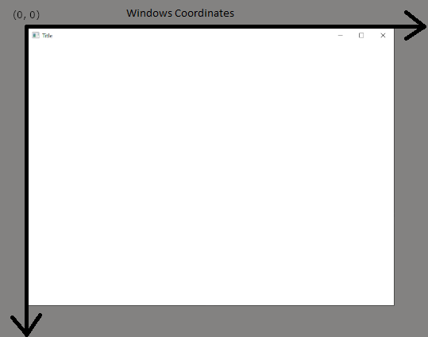

# HelloWindow

## The Entry Point

### ASCII Entry Point

```cpp
int WINAPI WinMain(HINSTANCE hInstance, HINSTANCE hPrevInstance, LPSTR pCmdLine, int nCmdShow);
```

### WndProc Callback

```cpp
LRESULT CALLBACK WndProc(HWND hwnd, unsigned msg, WPARAM wParam, LPARAM lParam)
{
    return DefWindowProc(hwnd, msg, wParam, lParam);
}
```

We'll be using the ASCII entry point

## Screen and Windows Coordinates




