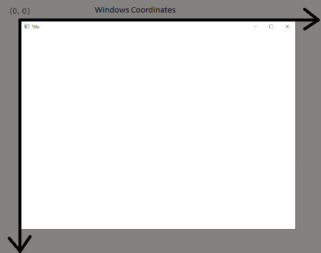
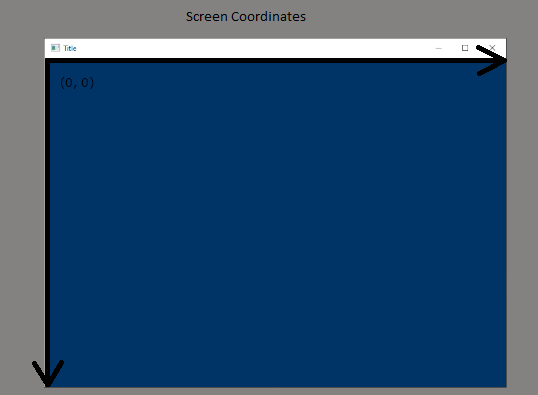

# HelloWindow

## The Entry Point

We'll be using the ASCII entry point:

```cpp
int WINAPI WinMain(HINSTANCE hInstance, HINSTANCE hPrevInstance, LPSTR pCmdLine, int nCmdShow);
```

## WndProc Callback

```cpp
LRESULT CALLBACK WndProc(HWND hwnd, unsigned msg, WPARAM wParam, LPARAM lParam)
{
    return DefWindowProc(hwnd, msg, wParam, lParam);
}
```

## Screen and Windows Coordinates



